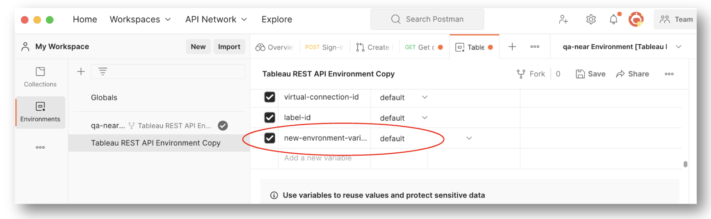
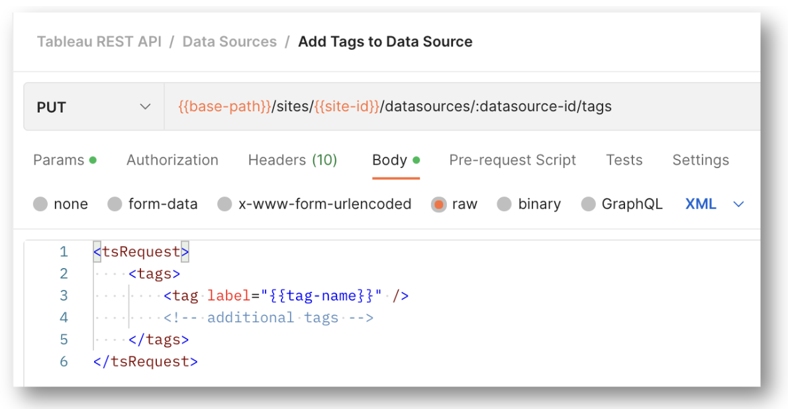

# Contributing to the Postman Collection

This collection is open source and we welcome your contributions! 

Contributions usually come in the form of enhancements to Postman files or documentation via pull requests as well as by reporting bugs as issues. 

> **About the repository:** This GitHub repository is only used for [issue tracking](https://github.com/tableau/tableau-postman/issues). Use [Salesforce Developer's Postman workspace](https://www.postman.com/salesforce-developers/workspace/salesforce-developers/collection/12721794-67cb9baa-e0da-4986-957e-88d8734647e2) to get the latest versions of the collection and environment files for your own use.
> The collection and environment files are hosted on Postman and synchronized to this repository for source control.
>For more information, see the _[How to Use the Collection](README.md#how-to-use-the-collection)_ section.

 

### Make a **Postman** pull request

> Make your pull requests for contributions to the collection **in the Postman environment**, not on this repo!

The basic steps are very similar to making a pull request in Git:

1. [Create a fork of the collection](https://www.postman.com/salesforce-developers/workspace/salesforce-developers/collection/12721794-7d783742-165f-4d10-8c4c-5719fb60fba2/fork?origin=sidebar) in Postman. You may also need to fork the environment variables file for this collection.

2. Make additions or other changes (see the next sectino for details).

3. Choose **Create a pull request** using the three dots to the right of the collection name.

4. It is a good idea to pair a pull request with an issue describing the enhancement your work aims to address.

For details, see [creating a Postman pull request for a fork](https://learning.postman.com/docs/collaborating-in-postman/using-version-control/version-control-overview/).

 

### Use environment variables for new or changed methods

This collection uses Postman environment variables to enable each person to customize for their own environment without editing requests. To add or change a method's request to the collection: 

1. Determine whether the existing environment variable file already has a variable for each resource the user will need to make the request.
2. If you need to add a variable for your collection change, then for each method: 

   1. Fork the environment file and the collection.
   2. Add the variable to the environment file list 

      
      
      Environment variable names in this collection are simple, lower case, hyphen separated descriptions of the resource they are pointed to.

3. Create a new request.
4. Use the appropriate environment variables in the URI and request body of your request. For example, for the Add Tags to Data Source request, 
      note that `{{site-id}}` uses an environment variable placeholder in the URI, and a `{{tag-name}}` placeholder in the request body.
      
      
 

### Report or explore issues **in Github**

> Issues are tracked **in this GitHub repo**.

Use the [Issues](https://github.com/tableau/tableau-postman/issues) page of this repo to create or see existing issues with the collection.
