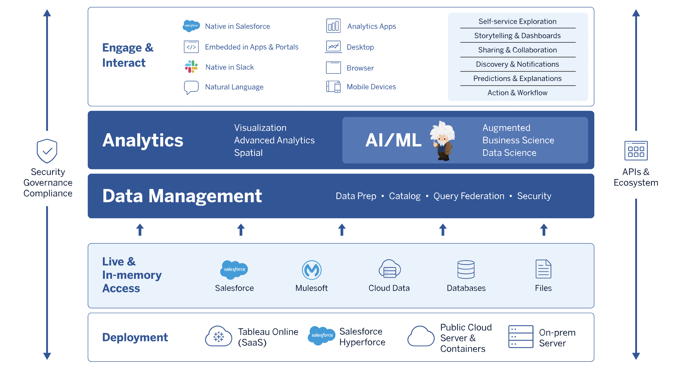

# Postman Collection for Tableau

Create an up-to-date Postman collection for Tableau Server &amp; Tableau Online to help Solution Engineers, customers, and partners master Tableau’s REST API. This resource will be useful for demonstrations, learning, development &amp; testing RESTful methods without needing to create an application.

## Overview

Create an up-to-date Postman collection for Tableau Server & Tableau Online to help Solution Engineers, customers, and partners master Tableau’s REST API. This resource will be useful for demonstrations, learning, development & testing RESTful methods without needing to create an application. An existing Postman resource is linked on the REST API’s documentation however, it has not been updated since 2017: _https://github.com/TableauExamples/Tableau_Postman_ (https://github.com/TableauExamples/Tableau_Postman)

## Goals

- Find all API resources that are documented with OpenAPI

- Translate the OpenAPI into Postman Collections

- Create new Postman Collections for API resources that do not have an OpenAPI spec.

- Decide if we will combine all API resources into a single collection or publish them as separate collections.

- Provide a teach-back for the embedded SE team and generate feedback.

- Record a teach-back explaining how to clone the repo and how to use the Postman collection to answer questions and explore the RESTful methods. To be used as a resource for other SEs, customers, and partners.

- Evaluate the need for writing collections that describe complete workflows (eg. create a project, create a group, add permissions, add users to the group and project).

## Specifications

One or multiple Postman collections created manually or exported from OpenAPI (whenever possible) with automated API token generation via prerequisite scripts, leveraging collection and environment variables. The underlying repository must be set up to encourage internal and external collaboration from the wider Tableau community as it will need to be updated over time.

## Milestones

* Prepare an Org & Repository on Github: *Join the Tableau Github Org and set up a repository with branch rules. Add a README, license, and CONTRIBUTING docs to enable others to contribute to this project.
* Identify all REST API resources with an OpenAPI spec: *We will export the OpenAPI documents into Postman collections. This workflow can also inform Product/Development on ways they can automate this process in the future.
* Manually document endpoints that lack an OpenAPI spec: *Most endpoints lack an OpenAPI description document, they will need to be documented manually using Postman.
* Determine the best way to organize the repository for consumption: *Options include writing a single Postman collection for all resources, which will be grouped via folders or created separate collections for each resource. Given that we have separate OpenAPI documents, having individual collections might be more compatible with the development workflow at Tableau.
* Prepare a teach-back for the Embedded SE Team: *Teach the team how to use these collections and master the Postman app so that it is easier to answer customer questions regarding our REST API. Gather feedback for a recording to be made available to all Tableau SEs.
* Record a demo of the project and share the resource internally: *Record a teach-back to enable all Tableau SEs on the use of the Postman collections so that they can learn about Tableau’s REST API beyond the documentation and are able to use the Postman app for exploration.
* Make the Postman Collection available to the Tableau Community: *Share the recorded teach-back with the wider Tableau community and make it available to customers.
