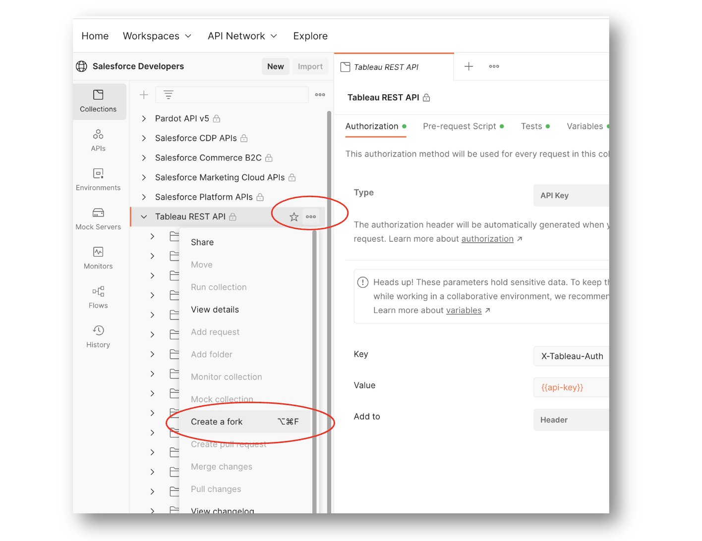
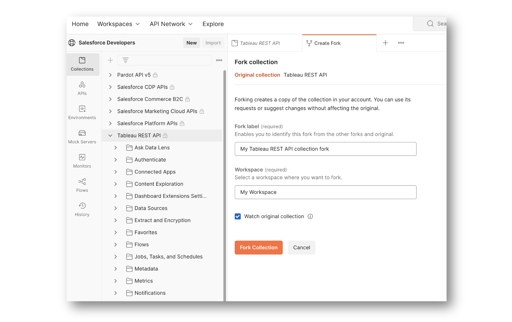
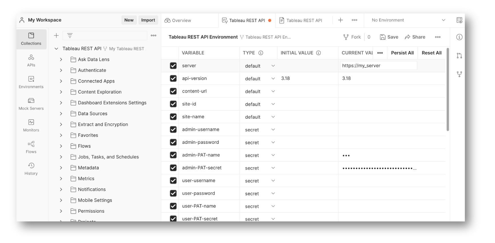
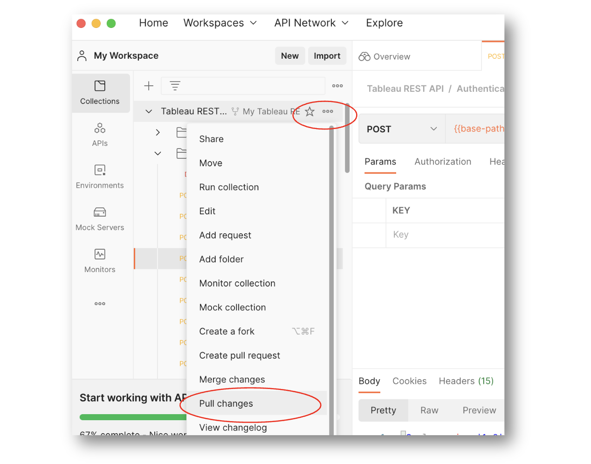
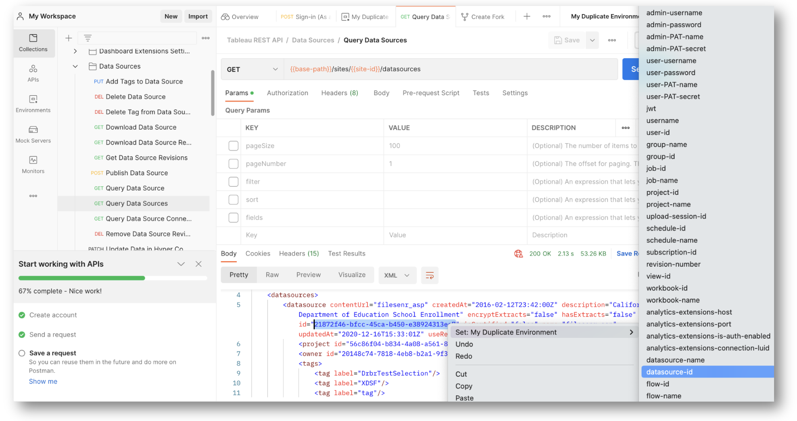
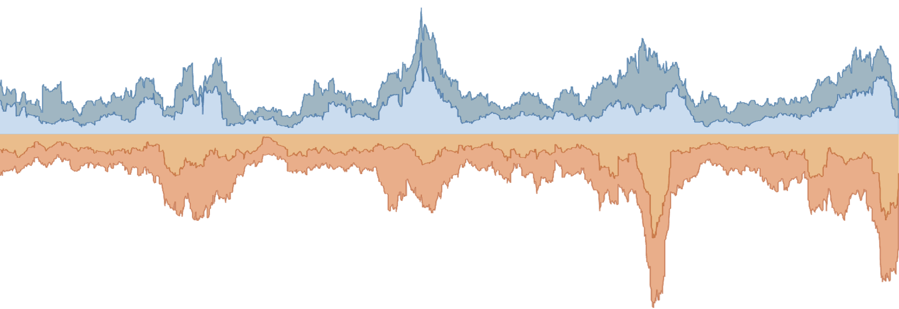

# Tableau REST API Postman Collection

[](https://www.tableau.com/support-levels-it-and-developer-tools)
[](https://raw.githubusercontent.com/Tableau/TabPy/master/LICENSE)

## Overview
This repository contains an open source collection of Postman requests for each method in the [Tableau REST API](https://help.tableau.com/current/api/rest_api/en-us/REST/rest_api.htm) surface. 

- **[How to use the collection](#how-to-use-the-collection)**
- **[How to contribute to the collection](#how-to-contribute-to-collection)** _(in the Postman app)_
- **[View or add issues](https://github.com/tableau/tableau-postman/issues)** _(in this repo)_
- **[Advanced usage](#advanced-usage)**

</br>

> **About the repository:** This GitHub repository is only used for [issue tracking](https://github.com/tableau/tableau-postman/issues). Use [Salesforce Developer's Postman workspace](https://www.postman.com/salesforce-developers/workspace/salesforce-developers/collection/12721794-67cb9baa-e0da-4986-957e-88d8734647e2) to get the latest versions of the collection and environment files for your own use.
> The collection and environment files are hosted on Postman and synchronized to this repository for source control.

> **About the Tableau REST API:** The Tableau REST API enables you to perform many of the actions available through the Tableau UI programmatically in scripts, terminals and applications. Resources you might find useful: 
>
>- For detailed descriptions of each method read the [REST API reference](https://help.tableau.com/current/api/rest_api/en-us/REST/rest_api.htm).
>- Join the [Tableau Developer Program](https://developer.tableau.com) (_includes a free Tableau sandbox and an invitation to join the #DataDev workspace on Slack!_).
>- Slack with REST API creators and users on **Tableau #Datadev** **#help-rest-api**.
>- Interact with fellow devs in the [Tableau REST API Community Forum](https://community.tableau.com/s/topic/0TO4T000000QFAxWAO/rest-api).

> **About this collection:** The preformatted requests in this collection allow you to discover and make calls for each method in the REST API to your Tableau Cloud site or Tableau Server. You can use it to make small administrative changes, prototype the request for your script, see a real example of the response for your request, and more. 
>
>The collection has also been enhanced with scripts and environment variables to make it easier to use.


## How to use the collection

To get started, follow these three steps:

1. _In Postman:_ [Fork the collection itself](#step-1-fork-the-tableau-rest-api-collection).
2. _In Postman:_ [Fork the environment variables for the collection](#step-2-fork-the-environment-variables-for-the-collection).
3. _In your fork_: [Declare values for variables](#step-3-declare-values-for-variables).

Once you have completed these steps you are ready to send requests to your Tableau environment!

Check out [Advanced Usage](#advanced-usage) for more additional tips and [Who to Thank](#who-to-thank) to find the original authors of this collection.

</br>

### **Step 1: Fork the Tableau REST API collection**

1. Go to the [Salesforce Developer's Postman workspace](https://www.postman.com/salesforce-developers/workspace/salesforce-developers/collection/12721794-67cb9baa-e0da-4986-957e-88d8734647e2) in a browser.
2. Sign in to or create a free Postman account.  
3. Choose the three dots next to **Tableau REST API** to view more actions.

4. Choose **Create a fork**.
5. Name the fork and the Postman workspace you want it to live in.
   
6.  Keep the **Watch original collection** checkbox selected to be alerted whenever updates are available to the collection.
7. Choose **Fork collection**. 
   
   > At this point you should see the collection in your Postman workspace.

</br>

### **Step 2: Fork the environment variables for the collection**

1. Go to the [**Environments**  section of the the Salesforce Postman workspace ](https://www.postman.com/salesforce-developers/workspace/salesforce-developers/collection/12721794-67cb9baa-e0da-4986-957e-88d8734647e2) .
1. Choose the three dots next to **Tableau REST API Environment** to view more actions.
3. Choose **Create a fork**.
4. Name the fork. 
1. Make sure to use the same Postman workspace you used for the collection.  
5.  Keep the **Watch original collection** checkbox selected to be alerted whenever updates are available to the collection.
6. Choose **Fork environment**.

   > Now you should see the **Tableau REST API Environment** environment variables in your Postman workspace.

7. Choose the three dots next to the forked environment and rename it to differentiate it from the original.

   > This way, if you want to set up multiple environments for different Tableau servers or sites, you can duplicate the original environment variables and customize credentials and other values per environment.
   
<br/>

### **Step 3: Declare values for variables**

To configure the collection for your Tableau environment: 

1. Go to the **Environment Variable** section of Postman and open the **Tableau REST API Environment** file.

    > ***NOTE:*** You can duplicate your fork to declare environment variables for different Tableau sites and servers. That way each set of environment variables can be saved for later use. 

   

1. For the `server` variable value, enter the domain of your Tableau service into the `CURRENT VALUE` field. For instance: 

   ```
   myserver.example.com
   ```
    or 
   
   ```
   10ay.online.tableau.com
   ```

2. Select the authentication method you wish to use and declare the `CURRENT VALUE` for those fields in the environment file. A detailed description of available methods can be found in the [Authentication section of the API Reference](https://help.tableau.com/current/api/rest_api/en-us/REST/rest_api_ref_authentication.htm#sign_in). Authentication methods include Username & Password, [Personal Access Token](https://help.tableau.com/current/online/en-us/security_personal_access_tokens.htm) (PAT), and JWT (Connected Apps).

   To understand how credentials impact the responses to obtain from Tableau's REST API, see [Tableau authentication credentials and permissions](#tableau-authentication-credential-and-permissions).

   </br>

1. Modify `content-url`, the permanent name of a Tableau site. The `content-url` in the following examples is "mySite":

   ```
   http://myServer.com/#/site/mySite/

   https://10ay.online.tableau.com/#/site/mySite
   ```

2. Set `api-version` to match the version of the REST API that you wish to use ([see REST API versioning](https://help.tableau.com/current/api/rest_api/en-us/REST/rest_api_concepts_versions.htm#rest_api_versioning)).

3. Save your changes.

4. Authenticate by running a sign in request and BOOM!, you are ready to use the collection.

   See [Auto Authentication](#auto-authentication) to skip manual sign in.

To learn more about using the REST API, try the [Get Started Tutorial](https://help.tableau.com/current/api/rest_api/en-us/REST/rest_api_get_started_tutorial_intro.htm) in the API reference.

</br>


## Advanced usage

- [Update your forks](#update-your-forks)
- [Tableau authentication credential and permissions](#tableau-authentication-credential-and-permissions)
- [Automatic Authentication](#automatic-authentication)
- [Set environment variables from response values](#set-environment-variables-from-response-values)
- [Credentials token, `site-id`, and `auto-auth`](#credentials-token-site-id-and-auto-auth)

</br>

#### **Update your forks**

  To update your collection forks, select the three dots next to the collection name, and then select **Pull changes**.

  

</br>

#### **Tableau authentication credential and permissions** 

Tableau credentials are mapped to individual users which enforce access controls and permissions defined in your Tableau environment. This means that certain methods are only available to admin users and API responses will only contain data that the given user has access to. 

A detailed description of authentication methods can be found in the [Authentication section of the API Reference](https://help.tableau.com/current/api/rest_api/en-us/REST/rest_api_ref_authentication.htm#sign_in). Authentication methods include Username & Password, [Personal Access Token](https://help.tableau.com/current/online/en-us/security_personal_access_tokens.htm) (PAT), and JWT (Connected Apps).

To understand how credentials are kept safe within Postman, refer to the documentation on [initial and current variables](https://learning.postman.com/docs/sending-requests/managing-environments/#adding-environment-variables) as well as [variable types](https://learning.postman.com/docs/sending-requests/variables/#variable-types).

You can use credentials for an admin user to get broad access to API methods and the resources they touch. That kind of access is reduced for Users with lesser permissions. To test granted permissions or troubleshoot a user's problem, an admin can  [impersonate other users](https://help.tableau.com/current/api/rest_api/en-us/REST/rest_api_ref_authentication.htm#sign_in) when needed.

This table shows the types of authentication supported in REST API requests.

| CREDENTIAL                  | VARIABLES (_Administrator , Impersonated User_)             |
| -----------                 | -----------            |
| Username & Password         | `admin-username` , `user-username`       |
|                             | `admin-password` , `user-password`    |
| Personal Access Token (PAT) | `admin-PAT-name` , `user-PAT-name`      |
|                             | `admin-PAT-secret` , `user-PAT-secret`    |
| Connected Apps (JWT)        | `JWT` (_scoped access via app code_)                 |

</br>

#### **Automatic Authentication** 

  To authenticate yourself in Tableau manually, you can choose and use one of the authentication methods that matches the credential type(s) that you have configured in your environment variables. You can also configure the collection to skip manual authentication and automatically authenticate when you make a request.

  To turn on auto authentication, choose the **Tableau REST API Collection** in Postman at the top level, and then choose the **Variables** tab, and set the current value of `auto-auth` to `true`.

  

  >***NOTE:*** If more than one type of credentials are configured in your environment variables, the type used by automatic authientication is not predictable. For instance, if valid credentials for both an administrator and a user to be impersonated are configured, the user that gets validated last will be the one signed in. Likewise, if PAT and username/password credentails are configured, the type of configuration used to sign in can't be predicted. If you need to control the sign in method, we recommend using manual sign in, or only configuring a single set of credentials in your environment variables.
  
</br>

#### **Set environment variables from response values**

Postman allows you to right-click on the returned value in a request's response body and assign that value to an environment value.  This is helpful because a common action is to make an initial request in order to obtain the ID or name of a resource (workbook, user, datasource, etc.) in order to use that value in a subsequent request to the REST API. 
  
This collection supplies a comprehensive list of variables for each Tableau resource type. Those variables are also formatted in the URI paths for each request. This means that using an ID or name from a response in the next request is quick, easy, and much less bug prone than copy pasting said values.



</br>

#### **Credentials token, `site-id`, and `auto-auth`**

In order to use Tableau's REST API effectively, it is very important to understand how authentication works as responses from the API will differ based on the user credentials used to establish a session to send requests. The 'Concepts' section of Tableau's API reference states the following [Signing In and Signing Out (Authentication)](https://help.tableau.com/current/api/rest_api/en-us/REST/rest_api_concepts_auth.htm):

>_The Tableau Server REST API requires that you send a credentials token with each request. The credentials token lets the server verify you as a valid, signed in user. To get a token, you call Sign In and pass credentials of a valid user, either a Personal Access Token (PAT), a user name and password, along with the content URL (subpath) of the site you are signing in to. A [subset of Tableau REST methods](https://help.tableau.com/current/online/en-us/connected_apps_scopes.htm#scopes-available-for-the-tableau-rest-api-tableau-online-only) support sign in using a JSON Web Token (JWT), typically generated by a Tableau [connected app](https://help.tableau.com/current/online/en-us/connected_apps.htm)._

In other words, your first request should aim to establish a new session using a set of credentials. Subsequent requests to Tableau require an `X-Tableau-Auth` header containing the API key or token as it's value. The API key is obtain as a successful response to a sign in method.

This Postman collection will automatically use new API keys (by storing them as the `api-key` variable) each time a response is received from the API containing a new session. This means that you should never need to worry about setting the `X-Tableau-Auth` header yourself since manual requests to a "Sign In" method or automatic authentication via `auto-auth` will already do this for you.

For security purposes the API key or session will expire and needs to be refreshed for continued use. When `auto-auth` is `true`, a script that performs the sign in flow runs before each request, ensuring that the token value is always valid. When `auto-auth` is `false`, you will need to manually sign in to refresh the `token value`. 
  
 <!-- </br> -->
<!-- - **Collection testing script** -->

<!-- </br> -->

<!-- - **Setting the accept header** -->

<!-- </br>  -->



## How to contribute to the collection

This collection is open source and we welcome your contributions! 

Contributions usually come in the form of enhancements to Postman files or documentation via pull requests as well as by reporting bugs as issues.

For more information, please refer to [CONTRIBUTING.md](CONTRIBUTING.md).

</br>

> **About the repository:** This GitHub repository is only used for [issue tracking](https://github.com/tableau/tableau-postman/issues). Use [Salesforce Developer's Postman workspace](https://www.postman.com/salesforce-developers/workspace/salesforce-developers/collection/12721794-67cb9baa-e0da-4986-957e-88d8734647e2) to get the latest versions of the collection and environment files for your own use.
> The collection and environment files are hosted on Postman and synchronized to this repository for source control.
>For more information, see the _[How to Use the Collection](README.md#how-to-use-the-collection)_ section.

</br>

## Who to Thank
The Tableau Postman collection is a gift to the Tableau community from three of Tableau's great Solutions Engineers: [Stephen Price](https://github.com/stephenlprice), [Jeremy Mayo](https://github.com/jeremymayo), and [Alex Cortez](https://github.com/joseacortez91). 

</br>
<a href="https://github.com/API-Guild/tableau-postman/graphs/contributors">
  
</a>

_Made with [contrib.rocks](https://contrib.rocks)._

